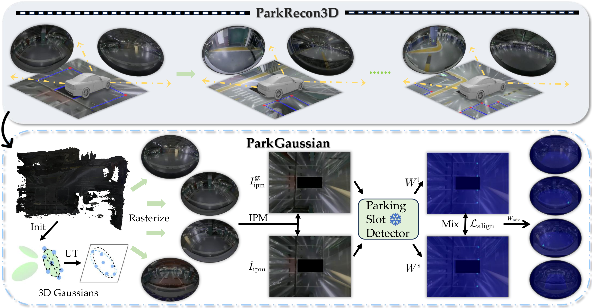

# ParkGaussian: Surround-view 3D Gaussian Splatting for Autonomous Parking

> [ParkGaussian: Surround-view 3D Gaussian Splatting for Autonomous Parking](https://arxiv.org/abs/2601.01386)  
> [Xiaobao Wei](https://ucwxb.github.io/), Zhangjie Ye$^\dagger$, Yuxiang Gu$^\dagger$, Zunjie Zhu, Yunfei Guo, Yingying Shen, Shan Zhao, Ming Lu, [Haiyang Sun](https://haiyangs.cn/)$^\dagger$, Bing Wang, Guang Chen, Rongfeng Lu$^\ddagger$, Hangjun Ye$^\ddagger$   
> ECCV2024 Main Conference Paper  
> $*$ Equal contribution $^\dagger$ Project leader $\ddagger$ Corresponding author 

## News
- **[2026/2/21]** ParkGaussian is accepted by CVPR2026! Code and datasets will be released soon. 

## Overview


Parking is a critical task for autonomous driving systems (ADS), with unique challenges in crowded parking slots and GPS-denied environments. However, existing works focus on 2D parking slot perception, mapping, and localization, 3D reconstruction remains underexplored, which is crucial for capturing complex spatial geometry in parking scenarios.
Naively improving the visual quality of reconstructed parking scenes does not directly benefit autonomous parking, as the key entry point for parking is the slots perception module. To address these limitations, we propose ParkGaussian, the first framework that integrates 3D Gaussian Splatting (3DGS) for parking scene reconstruction.
To further improve the alignment between reconstruction and downstream parking slot detection, we introduce a slot-aware reconstruction strategy that leverages existing parking perception methods to enhance the synthesis quality of slot regions.
Experiments on ParkRecon3D demonstrate that ParkGaussian achieves state-of-the-art reconstruction quality and better preserves perception consistency for downstream tasks. The code and dataset will be released. 

## Citation

If you find this project helpful, please consider citing the our paper:
```
@inproceedings{wei2026parkgaussian,
  title={ParkGaussian: Surround-view 3D Gaussian Splatting for Autonomous Parking},
  author={Wei, Xiaobao and Ye, Zhangjie and Gu, Yuxiang and Zhu, Zunjie and Guo, Yunfei and Shen, Yingying and Zhao, Shan and Lu, Ming and Sun, Haiyang and Wang, Bing and others},
  booktitle={Proceedings of the IEEE/CVF Conference on Computer Vision and Pattern Recognition},
  year={2026}
}

```
